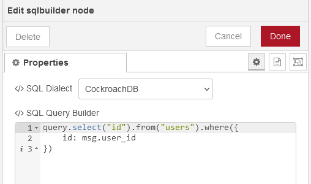

# SQL - Module for Node-Red #

## Description ##

A "batteries included" SQL query builder for CockroachDB, MariaDB, MSSQL, MySQL, PostgreSQL, SQLite3, Oracle DB, and Amazon Redshift designed to be flexible, portable, and fun to use.

## Snapshot ##



# Example Queries

```
query.select("id").from("users").where({
    id: msg.user_id
})
```